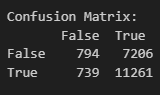
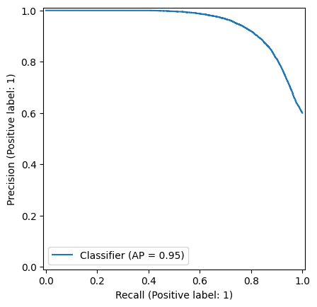

# Diabetes Predictor - More than just being "healthier"

## Xavier Garcia

### CSC 466 - Fall 2025

## The Problem

According to the World Health Organization (WHO), diabetes is "a chronic disease that occurs either when the pancreas does not produce enough insulin or when the body cannot effectively use the insulin it produces." Individuals with diabetes face an increased risk of suffering a heart attack, stroke, and kidney failure, among other health problems. Approximately 830 million people worldwide have diabetes in 2025. This number has been steadily increasing over the past several decades.

Additionally, on a personal note, I have family members who have or had diabetese, so the topic is somewhat of personal interest to me, although I entered this project without much prior knowledge of what factors _actually_ play a role in a diabetes diagnosis. This project was intended to serve as my way of understanding what factors contribute towards developing diabetes, and whether knowing these factors allows individuals to better prevent developing diabetes.

## The Approach

To accomplish this, I utilized a dataset from Kaggle titled _Diabestes Health Indicators Dataset_ uploaded by Krishna Thalla. This data set contains a large set of columns that I took into consideration in the creation of my classification models.

### EDA

I narrowed down my feature space through looking at the following correlation matrix.

This plot highlights the correlation matrix between a set of the features in the dataset. Using this, I was able to remove some features that are highly correlated. Some of these features seemed to serve as a sanity check. For instance, _ldl_cholesterol_ and _hdl_cholesterol_ seemed to be correlated, which makes sense. I ended up removing both since _total_cholesterol_, another feature in the model, is calculated using the previous two.

Additionally, I found the features _glucose_postprandial_ and _glucose_fasting_ contained the most distinct bimodal distributions of the feature distributions I plotted.

### Model Selection

The goal of this project is to predict whether an individual will be diagnosed with diabetes from some set of known information about them. Since being diagnosed with diabetes may come with significant ramifications, recall was optimized over precision. After training, hyperparameter tuning, and evaluating KNN classificaiton models, random forest classification models, and logistic regression classificaiton models, the model that typically performed the highest, in regards to recall, was the logistic regression model.

### Making Sense of the Model

The set of features that generated the highest recall at a rate of 0.9384 were the average amount of physical activity minutes per week, BMI, and the average amount of sleep hours per day. This recall rate is incredibly high, which is great when optimizing for recall. However, the precision rate was pretty low at a rate of 0.6098. While precision isn't the focus, this was concerning because it, along with the following confusion matrix, was the result of the model predicting the majority of individuals had diabetes. Casting a wide net like this isn't a very useful predictor.

The set of features that resulted in this highest recall while also maintaining and acceptable level of precision were the average amount of physical activity minutes per week, BMI, glucose fasting levels, and glucose postprandial levels. The recall rate of this model was 0.8754 and the precision was 0.8494. The resulting confusion matrix and PR-Curve are below.

### Unpacking the Results

Glucose, or blood sugar, is the energy the body creates from the food it consumes, (ADA). The body produces insulin which helps transport glucose to all the cells of the body so that they have the energy to function. Consequentially, measuring glucose levels is often used as some of a set of tests to determine if someone has diabetes. Each of _glucose fasting_ and _glucose postprandial_ are used as separate tests, however, in this dataset, it is unclear of how individuals were labeled as having diabetes or not. So, I cannot definitively determine whether those features contributed to the labeling of the data, but as they are real metrics and factors that medical professionals use to make diabetes diagnoses, they can be included as valid features in the model without too large a concern for target or data leakage.

Glucose fasting is the measure of an individual's blood sugar level in their blood after an eight to twelve hour fast, consuming only water if anything. Glucose postprandial is the measure of an individual's blood sugar level after consuming food or drink. Individuals with diabetes often have higher blood sugar levels for both of these metrics than individuals without diabetes. In fact, when using glucose fasting to test for diabetes, an individual who has a glucose fasting result of 126 mg/dL on two tests is considered to have diabetes, although other tests are often used in conjunction with this test to confirm the diagnoses.

Obviously, individuals who do not know they have diabetes may not have access to these glucose metrics that come from examining their blood. But, if they have access to this information, this model would aid in predicting whether or not they may have diabetes. However, since these datapoints of individuals were taken at a point in time, it is possible that an individual without diabetes may have a large glucose fasting reading without having diabetes.

As discussed earlier, individuals with and without diabetes may often have similar activity and sleep levels. This motivated me to look into what other factors may then cause the difference in glucose levels. It may be that this data recorded everything well after knowing if an individual had diabetes or not, which may have enticed individuals with diabetes to alter their lifestyles to be more health-conscious, but the dataset does not state this. Regardless, healthy lifestyles help in preventing individuals from developing diabetes, but what is and isn't healthy isn't as cut-and-dry as many may perceive it to be. An individual's blood sugar often does depend on that individual's habits, but there are other factors that individuals should consider when trying to prevent diabetes. For example, the 2015 CBS News article titled "'Huge' differences even though people ate the same foods" highlighted how individuals' bodies and blood sugar levels may respond differently to the same foods, even when those individuals do not have diabetes and those foods are universally considered healthy. The article gives and example of a woman with prediabetes whose blood sugar increases after eating tomatoes. The woman indicated that before participating in the study highlighted in the article, her past attempts at various healthy diets all failed.

## Conclusion

This project reinforces the importance of healthy habits in preventing diabetes while also highlighting how everybody's body is different and there is no one-size-fits-all approach to health and diabetes prevention. Living a healthy lifestyle seems to be the best thing an individual can do under their own power to prevent diabetes, but not all factors are under their control.

## Sources

Dataset name: **Diabetes Health Indicators Dataset**
The data comes from Mohan Krishna Thalla on Kaggle @ https://www.kaggle.com/datasets/mohankrishnathalla/diabetes-health-indicators-dataset

“10 Surprising Things That Can Spike Your Blood Sugar.” Centers for Disease Control and Prevention, Centers for Disease Control and Prevention, www.cdc.gov/diabetes/living-with/10-things-that-spike-blood-sugar.html. Accessed 3 Dec. 2025.

“Blood Glucose and Insulin.” Blood Glucose and Insulin | American Diabetes Association, diabetes.org/about-diabetes/high-blood-sugar. Accessed 3 Dec. 2025.

“Diabetes Diagnosis.” Diabetes Diagnosis & Tests | ADA, diabetes.org/about-diabetes/diagnosis. Accessed 3 Dec. 2025.

“Diabetes.” World Health Organization, World Health Organization, www.who.int/health-topics/diabetes#tab=tab_1. Accessed 3 Dec. 2025.

“‘Huge’ Differences Even Though People Ate the Same Foods.” CBS News, CBS Interactive, 19 Nov. 2015, www.cbsnews.com/news/huge-differences-even-when-people-ate-the-same-foods/.
