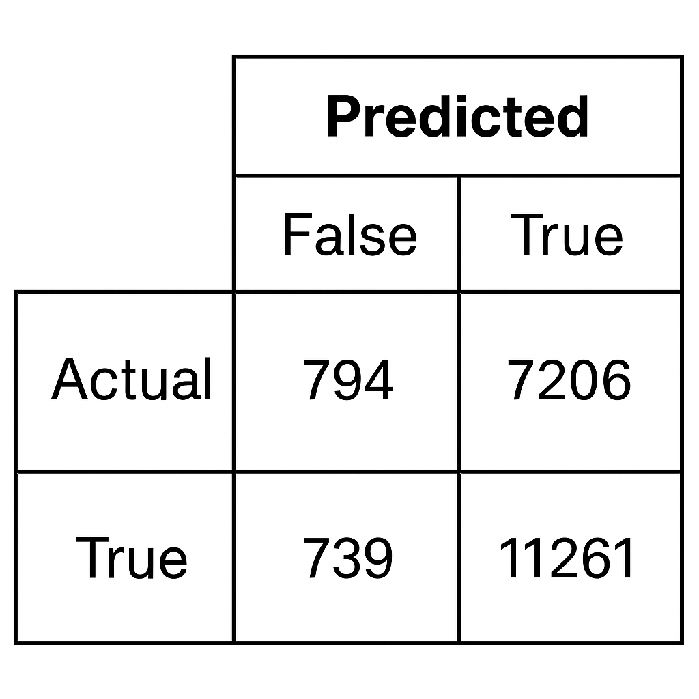
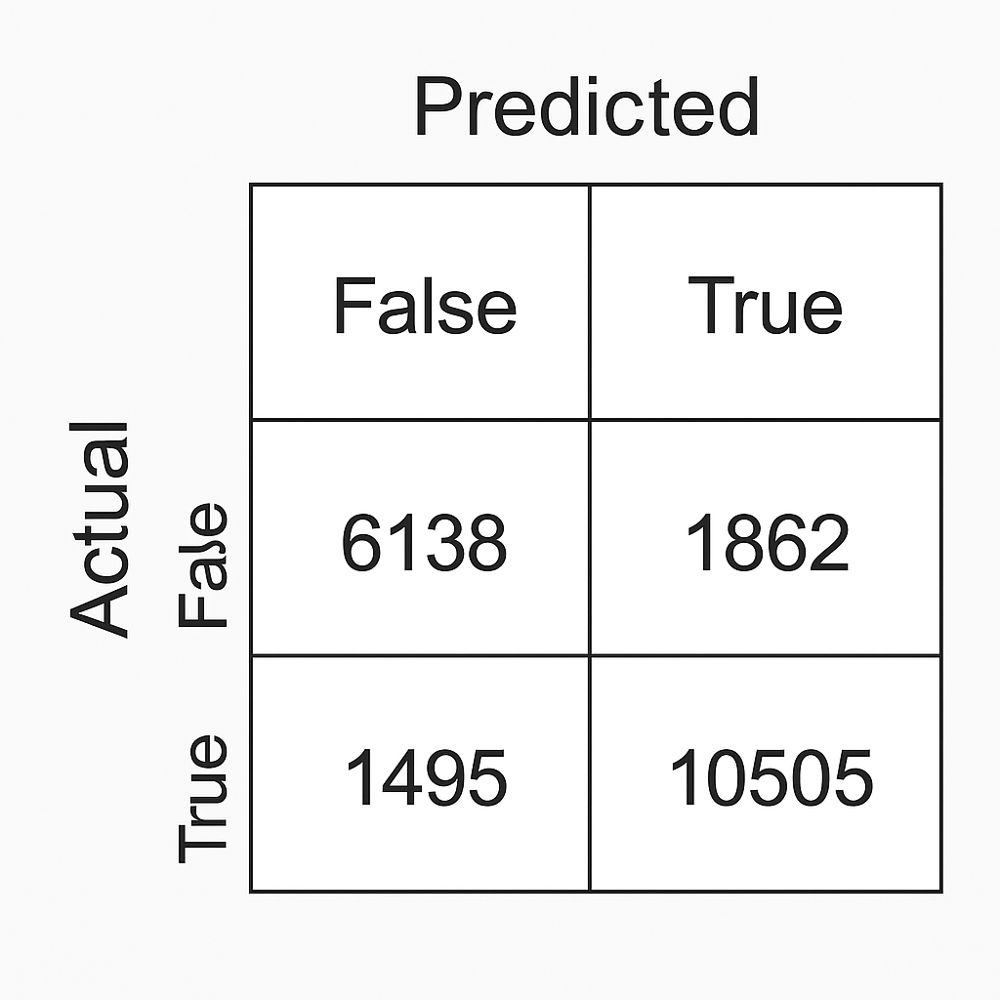

# Diabetes Predictor - More than just being "healthier"

## Xavier Garcia

### CSC 466 - Fall 2025

## The Problem

According to the World Health Organization (WHO), diabetes is "a chronic disease that occurs either when the pancreas does not produce enough insulin or when the body cannot effectively use the insulin it produces." Individuals with diabetes face an increased risk of suffering a heart attack, stroke, and kidney failure, among other health problems. Approximately 830 million people worldwide have diabetes in 2025. This number has been steadily increasing over the past several decades.

Additionally, on a personal note, I have family members who have or had diabetese, so the topic is somewhat of personal interest to me, although I entered this project without much prior knowledge of what factors _actually_ play a role in a diabetes diagnosis. This project was intended to serve as my way of understanding what factors contribute towards developing diabetes, and whether knowing these factors allows individuals to better prevent developing diabetes.

## The Approach

To accomplish this, I utilized a dataset from Kaggle titled _Diabestes Health Indicators Dataset_ uploaded by Krishna Thalla. This data set contains a large set of columns that I took into consideration in the creation of my classification models.

### EDA

I narrowed down my feature space through looking at the following correlation matrix.

This plot highlights the correlation matrix between a set of the features in the dataset. Using this, I was able to remove some features that are highly correlated. Some of these features seemed to serve as a sanity check. For instance, _ldl_cholesterol_ and _hdl_cholesterol_ seemed to be correlated, which makes sense. I ended up removing both since _total_cholesterol_, another feature in the model, is calculated using the previous two.

Additionally, I found the features _glucose_postprandial_ and _glucose_fasting_ contained the most distinct bimodal distributions of the feature distributions I plotted.

### Model Selection

The goal of this project is to predict whether an individual will be diagnosed with diabetes from some set of known information about them. Since being diagnosed with diabetes may come with significant ramifications, recall was optimized over precision. After training, hyperparameter tuning, and evaluating KNN classificaiton models, random forest classification models, and logistic regression classificaiton models, the model that typically performed the highest, in regards to recall, was the logistic regression model.

### Making Sense of the Model

The set of features that generated the highest recall at a rate of 0.9384 were the average amount of physical activity minutes per week, BMI, and the average amount of sleep hours per day. This recall rate is incredibly high, which is great when optimizing for recall. However, the precision rate was pretty low at a rate of 0.6098. While precision isn't the focus, this was concerning because it, along with the following confusion matrix, was the result of the model predicting the majority of individuals had diabetes. Casting a wide net like this isn't a very useful predictor.

<!--  -->

The set of features that resulted in this highest recall while also maintaining and acceptable level of precision were the average amount of physical activity minutes per week, BMI, glucose fasting levels, and glucose postprandial levels. The recall rate of this model was 0.8754 and the precision was 0.8494. The resulting confusion matrix and PR-Curve are below.

<!--  -->

### Unpacking the Results

## Sources

Dataset name: **Diabetes Health Indicators Dataset**
The data comes from Mohan Krishna Thalla on Kaggle @ https://www.kaggle.com/datasets/mohankrishnathalla/diabetes-health-indicators-dataset

“10 Surprising Things That Can Spike Your Blood Sugar.” Centers for Disease Control and Prevention, Centers for Disease Control and Prevention, www.cdc.gov/diabetes/living-with/10-things-that-spike-blood-sugar.html. Accessed 3 Dec. 2025.

“Blood Glucose and Insulin.” Blood Glucose and Insulin | American Diabetes Association, diabetes.org/about-diabetes/high-blood-sugar. Accessed 3 Dec. 2025.

“Diabetes.” World Health Organization, World Health Organization, www.who.int/health-topics/diabetes#tab=tab_1. Accessed 3 Dec. 2025.

“‘Huge’ Differences Even Though People Ate the Same Foods.” CBS News, CBS Interactive, 19 Nov. 2015, www.cbsnews.com/news/huge-differences-even-when-people-ate-the-same-foods/. 